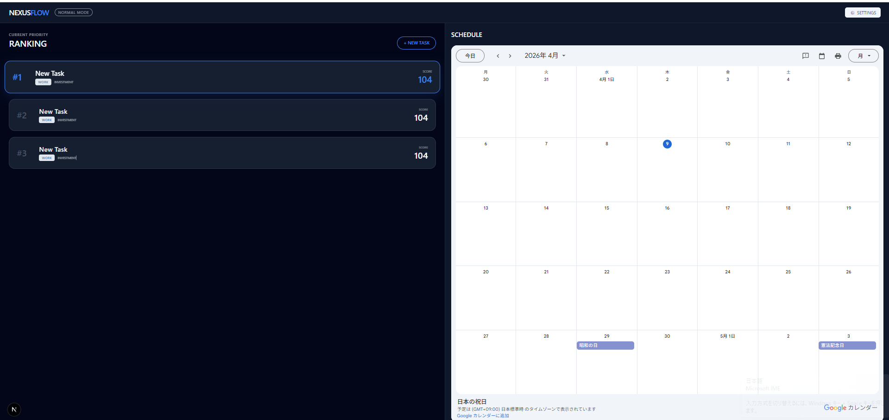

# NexusFlow

## 📸 画面イメージ

タスクの優先順位がリアルタイムで変化するダッシュボード画面

---

## 🚀 このアプリでできること

- タスクを登録するだけで優先順位が自動決定
- 「やりたい」と「やるべき」を同時に考慮
- 次にやるべき行動が一目で分かる

---

## 💡 このアプリの強み

タスク管理と意思決定ロジックを一体化し、  
「考える時間」を減らして「行動」に集中できる設計です。

---

## 🧠 概要

タスクの実行と意思決定を統合し、「次に何をやるべきか」を判断しやすくするワークフロー管理アプリです。

従来のタスク管理では「タスクの一覧」と「優先順位の判断」が分離しており、意思決定に時間がかかる課題がありました。  
本アプリでは評価ロジックを組み込むことで、行動に直結する設計を目指しています。

---

## ✨ 主な機能

- タスクの登録・一覧表示
- 締切・重要度・熱量に基づくスコアリング
- 優先順位の自動並び替え
- 「やりたい」と「やるべき」のバランス可視化

---

## 🔧 技術スタック

- Next.js
- TypeScript
- React
- Tailwind CSS

---

## 💡 実装のポイント

- React Hooksによる状態管理（追加・編集・削除）
- スコアリングロジックによる優先順位自動算出
- 条件に応じたリアルタイムソート
- コンポーネント分割による保守性向上

---

## 🧠 工夫した点

- タスク管理と評価ロジックを一体化した設計
- 主観（やりたい）と客観（やるべき）を掛け合わせたスコア設計
- 納得感のある優先順位を重視したUI
- 将来的な拡張を見据えた構成

---

## 🚧 現在の状況

- タスク登録・表示：〇
- 優先順位スコア計算：〇
- データ保存：未対応
- 認証機能：未対応

---

## 🔄 今後の改善

- ユーザー認証機能の追加
- データの永続化（DB連携）
- UI/UX改善
- スコアリングロジックの精度向上

---

## 📄 補足（設計について）

本プロジェクトでは、仕様を `spec.yaml` に定義し、設計と実装を分離しています。  
仕様を起点とした開発により、ロジックの一貫性と保守性を高めています。

---

## 📚 ドキュメント

- 詳細仕様: [docs/spec.yaml](docs/spec.yaml)
- 開発ログ: [docs/dev-log.md](docs/dev-log.md)

---

## 🔗 関連プロジェクト

- LogicDeck（前身アプリ）